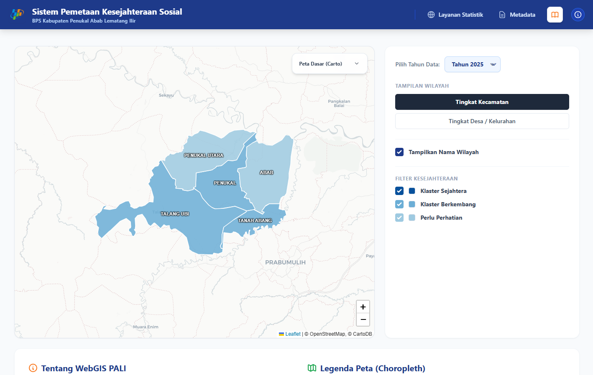
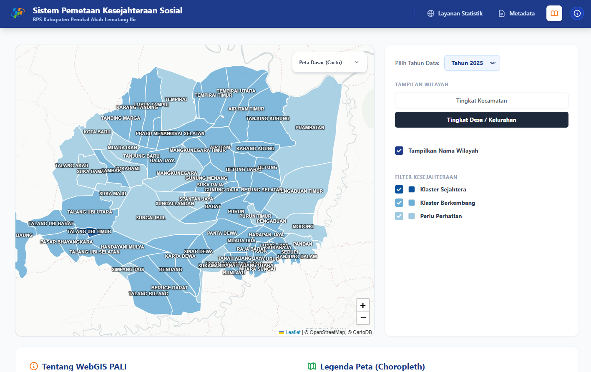
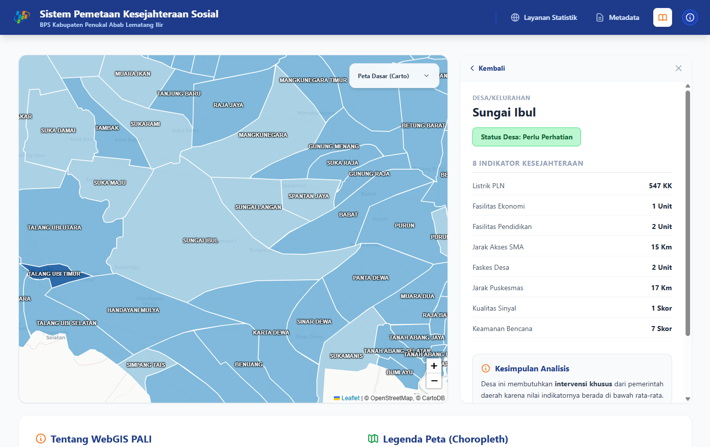
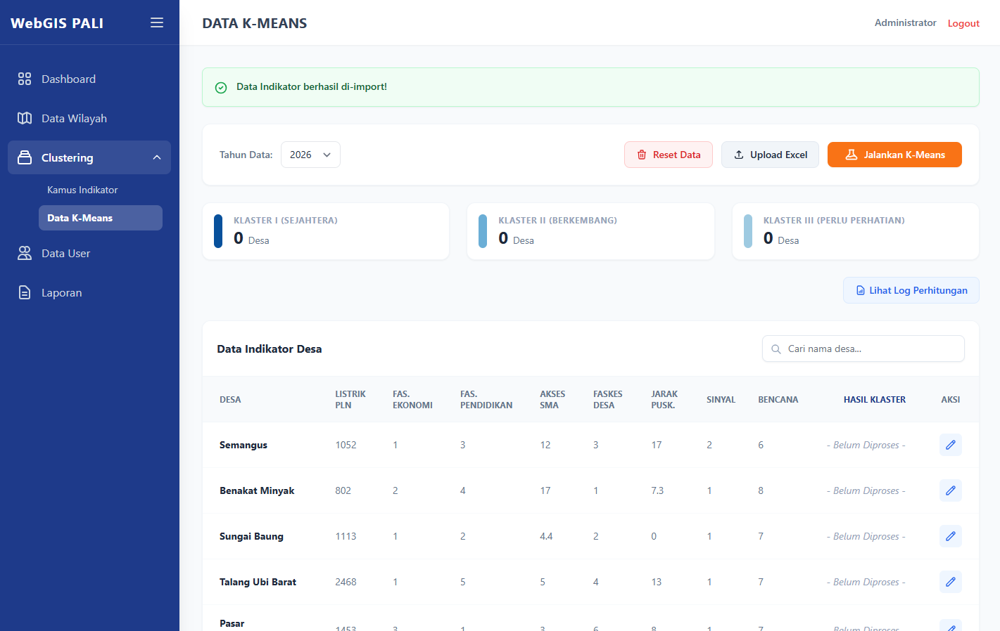
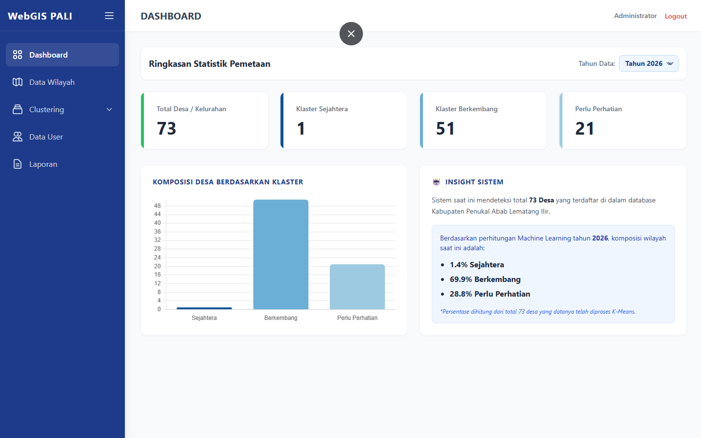

# 🗺️ WebGIS PALI: Sistem Pemetaan Kesejahteraan Sosial Berbasis Machine Learning

<p align="center">
  
</p>

<p align="center">
  <a href="#-tentang-proyek">Tentang Proyek</a> •
  <a href="#-fitur-unggulan">Fitur Unggulan</a> •
  <a href="#-arsitektur-teknis">Arsitektur</a> •
  <a href="#-algoritma-k-means">Algoritma</a> •
  <a href="#-panduan-instalasi">Instalasi</a>
</p>

---

## 📖 Tentang Proyek
**WebGIS PALI** adalah sebuah Sistem Informasi Geografis (SIG) skala *Enterprise* yang dirancang khusus untuk Badan Pusat Statistik (BPS) Kabupaten Penukal Abab Lematang Ilir. Sistem ini mengotomatisasi proses evaluasi kesejahteraan wilayah perdesaan yang sebelumnya dilakukan secara manual.

Sistem ini memadukan **Analisis Spasial (Leaflet.js)** dengan **Kecerdasan Buatan (K-Means Clustering)** untuk memproses 8 indikator infrastruktur dan sosial secara objektif. Tujuannya adalah memberikan landasan kuantitatif bagi Pemerintah Daerah dalam mengalokasikan bantuan sosial dan pembangunan infrastruktur secara presisi.

---

## ✨ Fitur Unggulan

### 1. Interaksi Spasial Dinamis (*Drill-Down GIS*)
Pengguna dapat membedah poligon tingkat kecamatan menjadi tingkat desa hanya dengan satu klik. Peta diwarnai secara *real-time* menggunakan palet kartografi monokromatik (Standar BPS) berdasarkan hasil *Machine Learning*.
<p align="center">
  
  
</p>

### 2. Smart Insight AI (Rule-Based Expert System)
Sistem secara otomatis menganalisis kelemahan infrastruktur dari setiap desa yang diklik (misal: jarak fasilitas kesehatan atau rasio elektrifikasi) dan memberikan narasi rekomendasi kebijakan dalam bahasa eksekutif yang mudah dipahami oleh pimpinan daerah.

### 3. Otomatisasi Algoritma (*Command Center*)
Administrator tidak perlu memahami kodingan Python. Sistem menyediakan fitur **Smart Excel Import** yang secara otomatis mencocokkan nama wilayah (mengatasi masalah *Foreign-Key Error*), menjalankan standarisasi Z-Score, dan melakukan iterasi K-Means langsung dari layar peramban.
<p align="center">
  
</p>

### 4. Ekosistem Validasi Eksekutif (*Locking System*)
Mengadaptasi alur birokrasi pemerintahan, data yang diproses tidak akan langsung tampil di Peta Publik. Draf laporan harus ditinjau, diberi catatan revisi, dan disetujui (ACC) oleh Pimpinan melalui Dashboard Analitik sebelum dikunci (*Published*) dan di- *render* menjadi PDF Laporan Administratif.
<p align="center">
  
</p>

---

## 🏗️ Arsitektur Teknis

Aplikasi ini dibangun menggunakan arsitektur *Monolithic* modern dengan pemisahan *concern* yang ketat (MVC + Service Pattern).

*   **Framework Backend:** Laravel 11/12 (PHP 8.2+)
*   **Database:** MySQL (Relational Database)
*   **Frontend UI:** Tailwind CSS, Alpine.js (Untuk reaktivitas *state* tanpa *reload*)
*   **Engine Spasial:** Leaflet.js dengan injeksi data JSON *On-The-Fly*
*   **Pustaka Data:** Maatwebsite/Excel, Chart.js

---

## 🧮 Bedah Algoritma K-Means (Under the Hood)
Sistem ini tidak menggunakan library ML instan, melainkan membangun ulang (*Hardcoded*) matematika K-Means ke dalam PHP menggunakan *Service Class Pattern* untuk membuktikan pemahaman konseptual:

1.  **Pre-Processing Inversi:** Variabel yang bersifat *Cost* (seperti Jarak tempuh fasilitas) dibalik secara otomatis agar sejalan dengan definisi kesejahteraan (Semakin besar angka, semakin sejahtera).
2.  **Standardisasi Z-Score:** Menormalisasi data menggunakan Rata-rata dan Standar Deviasi untuk mengatasi ketimpangan nilai ekstrem (seperti ribuan pengguna listrik vs satuan bangunan sekolah).
3.  **Deterministic Initialization:** Menghindari penyakit bawaan K-Means (*Local Optima* / Hasil Acak) dengan mengurutkan nilai *Z-Score* dan mematok titik awal centroid pada nilai tertinggi, median, dan terendah.
4.  **Bottom-Up Aggregation:** Menggunakan metode **Rata-rata Tertimbang (Weighted Average)** untuk mengagregasi status puluhan desa menjadi satu kesimpulan status di tingkat Kecamatan, guna meminimalisir bias ketimpangan jumlah desa antar wilayah.

---

## ⚙️ Panduan Instalasi (Development)

Jika Anda ingin menjalankan aplikasi ini di mesin lokal Anda:

1. Kloning repositori ini:
   ```bash
   git clone https://github.com/username-anda/webgis-pali.git
   cd webgis-pali